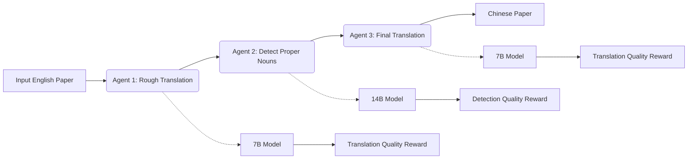
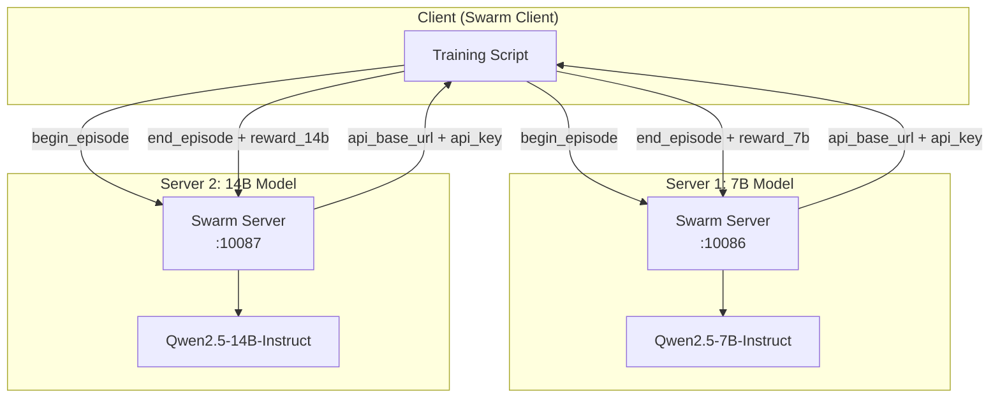
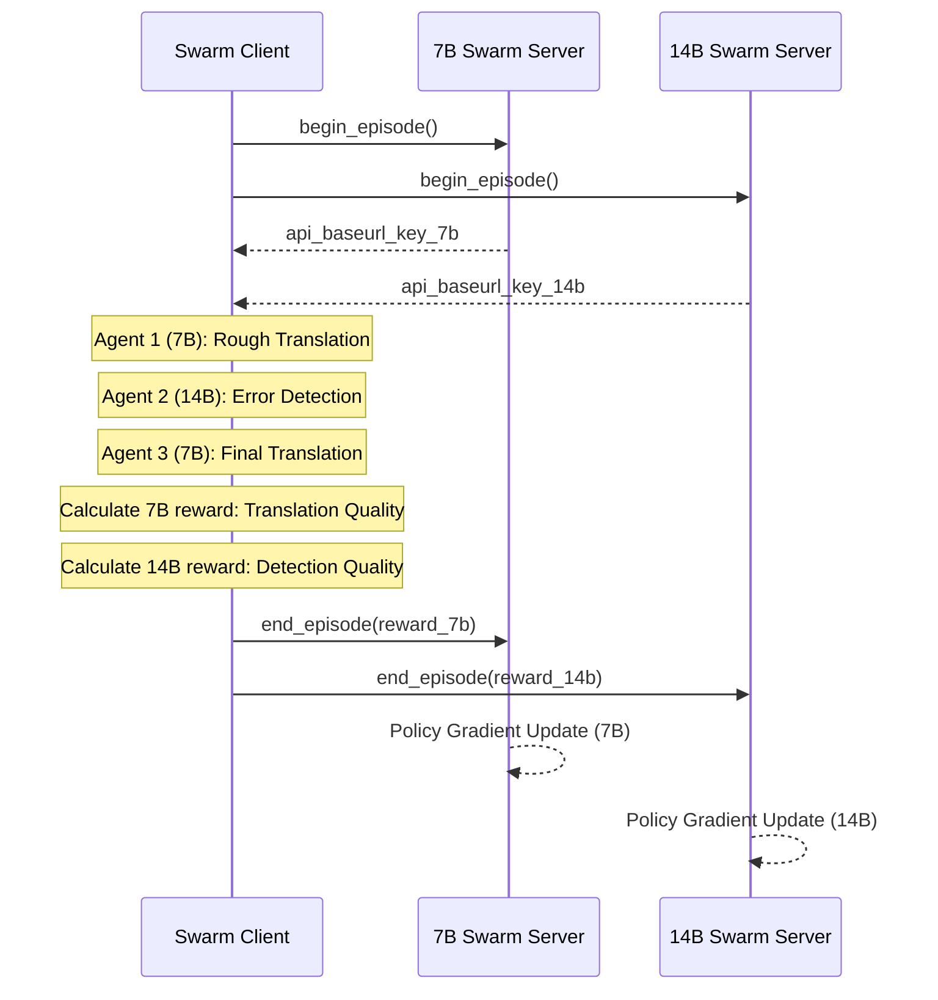

# Non-Shared Parameter Multi-Agent Reinforcement Learning

> The original document is [Chinese Version](https://modelscope.github.io/AgentJet/en/example_train_multi_model.zh/)

In traditional Multi-Agent Reinforcement Learning (MARL) systems, all agents typically share the same model parameters—meaning no matter how many agents exist, they share a single "brain." While this design is simple, it has clear limitations in practice: different agents may require different model scales to handle tasks of varying complexity. AgentJet's Swarm training mode breaks this limitation, enabling true **non-shared parameter multi-agent reinforcement learning**.

## Background: From "Shared Brain" to "Heterogeneous Teams"

When training multi-agent systems in traditional frameworks, researchers face an implicit assumption: all agents must share the same underlying model. This design stems from architectural limitations of most training backends (like VERL and TRL)—they typically only support fine-tuning a single LLM model.

However, this "shared brain" design is not economical in many scenarios:

- **Capability Mismatch**: An agent responsible for high-level planning may need a 32B large model to ensure reasoning quality, while an agent responsible for specific execution may be sufficient with a 7B small model
- **Resource Waste**: Using large models for simple tasks wastes computational resources
- **Single Training Signal**: All agents receive the same reward signal, making it difficult to optimize specifically for their respective tasks

AgentJet Swarm mode achieves true **heterogeneous multi-model training** by deploying multiple independent Swarm Servers, each hosting models of different sizes. Each model can have independent training configurations, reward functions, and optimization objectives.

## Example Scenario: Academic Paper Translation Workflow

Let's understand how non-shared parameter multi-agent reinforcement learning works through a concrete example. This example implements a three-stage academic paper translation workflow:



In this workflow:

- **Agent 1 (Rough Translation)**: Uses a 7B model to initially translate English papers to Chinese
- **Agent 2 (Detect Proper Nouns)**: Uses a 14B model to detect proper noun errors in the translation (such as terminology translation, abbreviation handling, etc.)
- **Agent 3 (Final Translation)**: Uses a 7B model to generate the final Chinese translation based on the detection results

## Core Innovation: Independent Reward Functions

In traditional approaches, all agents share the same reward signal—no matter which Agent produces output, the reward is calculated based on the final translation quality. This design has a fundamental problem: Agent 2 (14B model) is actually being trained for "final translation quality" rather than "detection quality," leading to vague training signals where the model struggles to learn true detection capability.

The innovation of this example is configuring **independent reward functions** for each model:

| Model | Agent Role | Reward Function | Evaluation Focus |
|-------|-----------|-----------------|------------------|
| 7B | Agent 1 & 3 | TranslationQualityGrader | Final translation quality (personal pronouns, abbreviations, word order, subject clarity) |
| 14B | Agent 2 | ProperNounDetectionGrader | Proper noun detection quality (completeness, accuracy, false positive rate) |

The advantages of this design:

1. **Task-Specific Training**: Each model learns the best strategy for its specific role
2. **Clear Signals**: The 14B model directly learns "how to detect errors" rather than "how to make the final translation look better"
3. **Resource Optimization**: Simple translation tasks use small models, complex detection tasks use large models
4. **Independent Evolution**: 7B and 14B models can optimize independently without interference

## System Architecture

AgentJet achieves non-shared parameter training by deploying **two independent Swarm Servers**:




**Architecture Explanation**:

- **Swarm Server 1 (Port 10086)**: Hosts the 7B model, responsible for Agent 1 and Agent 3's inference and training
- **Swarm Server 2 (Port 10087)**: Hosts the 14B model, responsible for Agent 2's inference and training
- **Swarm Client**: Runs on any device, responsible for workflow orchestration and reward calculation

The client code only needs to pass two different `api_baseurl_key` values, corresponding to the two models:

```python
def rollout(task):
    # Get independent API credentials from two Swarm Servers
    episode_uuid_7b, api_baseurl_key_7b = swarm_worker_7b.begin_episode()
    episode_uuid_14b, api_baseurl_key_14b = swarm_worker_14b.begin_episode()

    # Execute workflow using two models
    workflow_output_7b, workflow_output_14b = execute_agent(
        task,
        api_baseurl_key_7b,
        api_baseurl_key_14b
    )

    # Report respective rewards to two Servers
    swarm_worker_7b.end_episode(task, episode_uuid_7b, workflow_output_7b)
    swarm_worker_14b.end_episode(task, episode_uuid_14b, workflow_output_14b)
```

## Reward Function Design

### 7B Model Reward: Translation Quality Assessment

The reward for the 7B model (Agent 1 and Agent 3) is calculated by `TranslationQualityGrader`, with evaluation criteria including:

- **First-person pronoun usage**: Prohibit "我们" (we), use "本研究" (this study), "本文" (this paper), etc.
- **Abbreviation translation**: Use abbreviations when concise Chinese expressions exist (e.g., GWs instead of "引力波" for gravitational waves)
- **Word order adjustment**: Sentences not adjusted to Chinese习惯 (habits)
- **Subject clarity**: Subject missing or unclear
- **Proper noun translation**: Domain terminology translation errors

Scoring ranges from 0-2 points, normalized to [0, 1].

### 14B Model Reward: Detection Quality Assessment

The reward for the 14B model (Agent 2) is calculated by `ProperNounDetectionGrader`, with evaluation criteria including:

- **Completeness**: Whether all key errors are detected (first-person pronouns, abbreviation issues, proper noun errors, etc.)
- **Accuracy**: Whether detected errors are accurate, whether correction suggestions are reasonable
- **False positive rate**: Whether correct translations are marked as errors
- **JSON format**: Whether output is valid JSON format

Also uses 0-2 point scoring system, normalized to [0, 1].

## Training Process

The entire training process is as follows:



In each training cycle:

1. Client simultaneously requests episode resources from both Swarm Servers
2. Execute the complete workflow, obtaining outputs from both models
3. Calculate two rewards separately: 7B based on final translation quality, 14B based on detection quality
4. Report respective rewards to corresponding Swarm Servers
5. Both Servers independently execute policy gradient updates

## Training Curves


## Advantage Summary

Compared to traditional single-model shared parameter training, non-shared parameter multi-agent reinforcement learning has significant advantages:

| Feature | Shared Parameters | Non-Shared Parameters (This Example) |
|---------|-------------------|--------------------------------------|
| Model Configuration | Single model | 7B + 14B heterogeneous combination |
| Reward Signal | Unified reward | Task-specific reward |
| Resource Utilization | Inefficient (large model for simple tasks) | Efficient (on-demand allocation) |
| Training Objective | All Agents optimize same objective | Each Agent optimizes its own objective |
| Scalability | Limited by single model capacity | Each component can scale independently |

## Further Reading

### Cross References

- **[AgentJet Swarm Training Mode](../swarm.md)**: Deep dive into AgentJet's swarm architecture design philosophy and core advantages
- **[Trainable Workflow](../workflow.md)**: Learn how to define multi-agent workflows in AgentJet
- **[Task Judger](../task_judger.md)**: Understand reward function design principles and customization methods
- **[Math Agent Example](../example_math_agent.md)**: Learn the basics of single-agent training

### Recommended Next Steps

1. **[Werewolves Game](../example_werewolves.md)**: Learn how to train multi-agent collaboration and competition in AgentJet
2. **[Academic Translation Swarm Training](../example_academic_trans_swarm/README.md)**: Learn about a simpler single-model version implementation
3. **[Swarm Training Blog](swarm_intro_blog_en.md)**: Deep understanding of more application scenarios for non-shared parameter training
